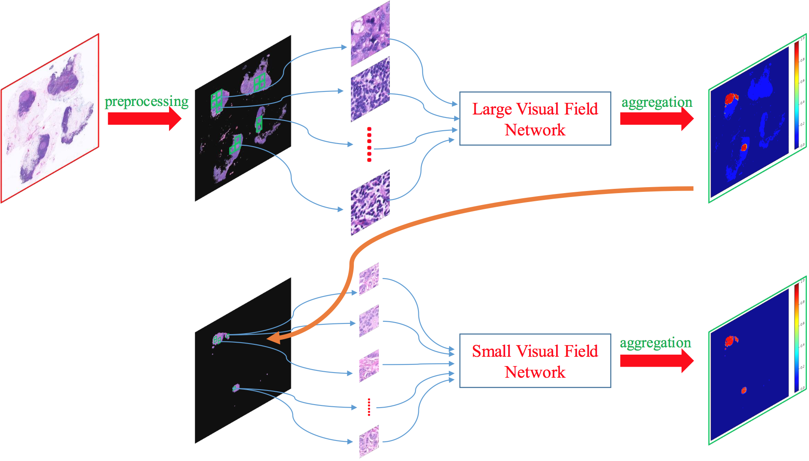

MVF-CasCNN
====

The Tensorflow implementation of our pricai18 paper [Multiple Visual Fields Cascaded Convolutional 
Neural Network for Breast Cancer Detection](https://drive.google.com/open?id=1m-6PjIEbmVW4Tjz4Bb81jlNFJ5H5eoOt).

<div align=center></div>

Dependencies
----
Python 2.7, Tensorflow 1.1.0, Openslide-python 1.1.1, Scikit-image 0.13.0, Scipy 1.1.0, Numpy 1.13.1, and Matplotlib 2.0.2.

Data Preparation
----
Our benchmark dataset is from [Camelyon16 Challenge](https://camelyon16.grand-challenge.org/). You can download the dataset from this [link](https://camelyon16.grand-challenge.org/Download/).

Quick Start
----
This code is mainly for testing. You can run the inference on testing dataset as follows:
1. We firstly utilize LVF-CNN (large visual field CNN) to coarsely locate the possible lesion areas. So to obtain LVF patches, please run **pathology_divide_test40X1196.py** to preprocess testing slides and divide them into patches.

2. Please run **pathology_test_tfrecords.py** to convert image patches to [tfrecord format](https://www.tensorflow.org/api_guides/python/python_io). You may find more useful information from this [link](https://www.tensorflow.org/api_guides/python/reading_data).

3. Please run **pathology_test_test.py** to create the initial LVF heatmaps. Meanwhile, don't forget to set your own paths in **pathology_test_preprocessing.py** and **pathology_test_eval.py**. The trained LVF-CNN model can be downloaded [here](https://drive.google.com/open?id=1jtRN2GGpxxtThsKkdk4LjzYkES1DMOeQ).

4. To get the final LVF heatmaps, please run **UpsampleLVFHeatmap.py**.

5. Subsequently, we leverage these LVF heatmaps to generate small visual field patches. Please run **pathology_generate_tumor_candidate.py** to sample SVF patches from tumor candidate areas. 

6. Then, use **pathology_test_tfrecords.py** to convert these patches to tfrecord format and run **pathology_test_test.py** to produce the final MVF-CNN heatmaps by SVF-CNN. The trained SVF-CNN model can be downloaded [here](https://drive.google.com/open?id=1ZPpmQbBFVoLzlZ7XuUyR-urPi3Ttt1sS). Also, remember to set your own paths in **pathology_test_preprocessing.py** and **pathology_test_eval.py**.
You can adopt **SaveHeatmapToFig.py** to visualize these heatmaps.

7. Finally, please utilize **Evaluating_AUC.py** and **Evaluating_FROC.py** to measure the performance. Both our final [MVF-CNN heatmaps]( https://drive.google.com/open?id=10tklxUWWG7LFHfeVgf6kFxNWRZCEB5Va) and [Ensemble MVF-CNN heatmaps](https://drive.google.com/open?id=13S-HcWCB6Y7pfoEsdQgIW9hlLUqgqvBq) are available online. You can directly justify the effectiveness of our methods by them.

About Training
----
We directly employ [Inception in Tensorflow](https://github.com/tensorflow/models/tree/master/research/inception) to train our large visual field model and small visual field network. But note that this version of Inception doesn't provide parameters for slimming down the model. So to get the slimmed-down Inception V3, you can replace its **inception/slim/inception_model.py** with [ours](https://github.com/nihaomiao/PRICAI18_MVF-CasCNN/blob/master/MVFCasCNN/slim/inception_model.py). Or you can choose to train the model using the newer version of [Inception](https://github.com/tensorflow/models/tree/master/research/slim). For more details about training process, please read our [paper](https://link.springer.com/chapter/10.1007/978-3-319-97304-3_41). 

Citing MVF-CasCNN
----
If you find our approaches useful in your research, please consider citing:
```
@inproceedings{ni2018multiple,
  title={Multiple Visual Fields Cascaded Convolutional Neural Network for Breast Cancer Detection},
  author={Ni, Haomiao and Liu, Hong and Guo, Zichao and Wang, Xiangdong and Jiang, Taijiao and Wang, Kuansong and Qian, Yueliang},
  booktitle={Pacific Rim International Conference on Artificial Intelligence},
  pages={531--544},
  year={2018},
  organization={Springer}
}
```
For any problems with the code, please feel free to contact me: homerhm.ni@gmail.com

Acknowledgement
----
Our MVF-CasCNN borrowed some functions from [Inception in Tensorflow](https://github.com/tensorflow/models/tree/master/research/inception).
